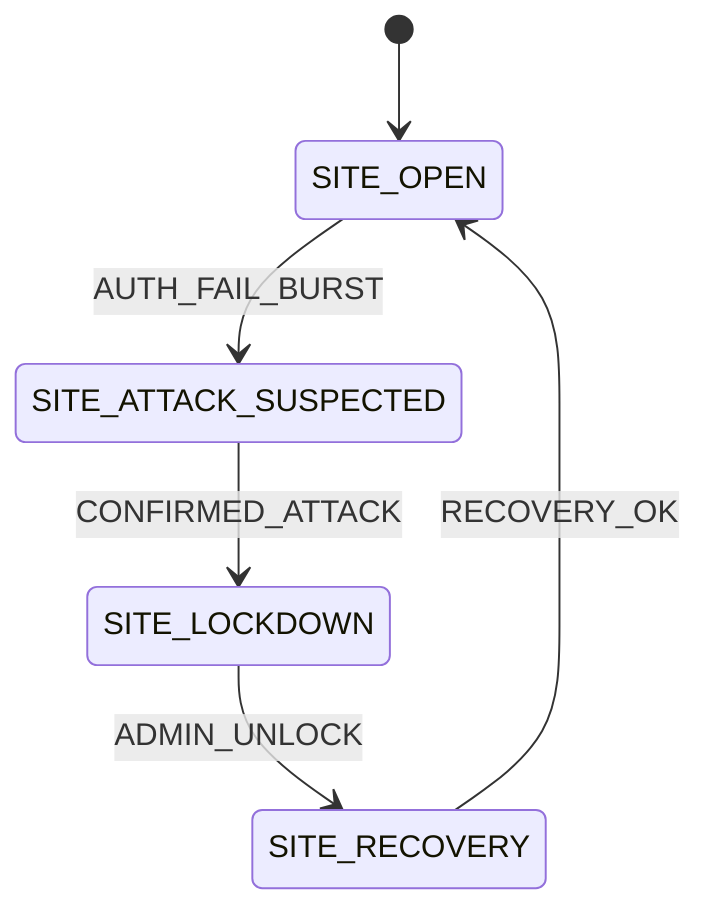
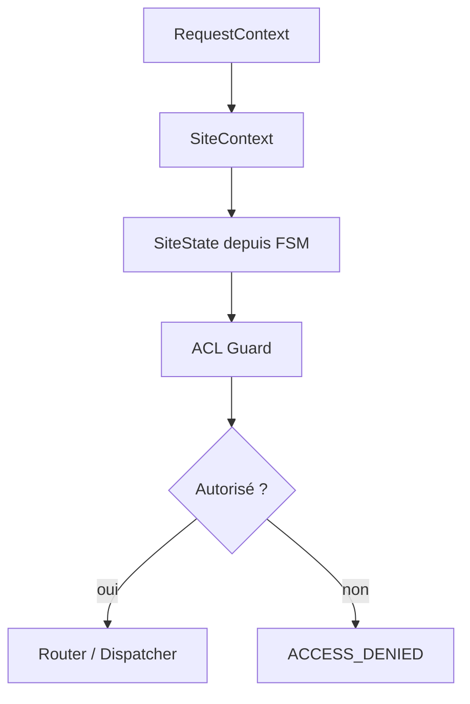

# P112C1 — Audit FSM + ACL ASAP original

Statut: AUDIT CONTRACTUEL — AUCUN PATCH CODE
Portée: ASAP original PHP5, socle FSM + ACL
Date: 2026-06-05

---

## 0. Contrat appliqué

Ce rapport applique le contrat `MAESTRO_WORKSPACE_ULTIMATE_CONTRACT.md`.

```text
NO SOURCE OF TRUTH, NO PATCH
NO DOC CONTRACT, NO PATCH
NO FALLBACK SILENCIEUX
NO HTML REFERENCE OUTPUT, NO DOC GENERATION VALIDATION
```

Cet audit ne porte pas de code dans le dépôt ASAP moderne. Il prépare uniquement le contrat de portage.

---

## 1. Source auditée

Archive utilisateur ASAP d’origine PHP5 :

```text
a25f039c-ed95-4c26-a290-68ded94c8c62.7z
```

Sous-arborescence analysée :

```text
demo/framework/ASAP/FSM/
demo/framework/ASAP/ACL/
demo/application/articles/acl/
```

---

## 2. Verdict d’architecture

L’ASAP original confirme que le vrai socle du framework n’est pas seulement routeur + templates.

Le socle noble est :

```text
ASAP CORE
  Application / Kernel
  FSM
  ACL
  Router
  Controller / Action
  Template adapters
```

La FSM agit comme un microprocesseur d’état :

```text
signal
state
nextState
action
memory
stack
fifo/lifo
timeout
saveState/loadState
```

L’ACL agit comme moteur d’autorisation :

```text
role
resource
privilege
allow/deny
condition
isAllowed
```

---

## 3. Décision GraphViz

`GraphViz.class.php` et `ASAP_FSM_GraphViz` sont historiques.

Décision moderne :

```text
GraphViz = référence historique uniquement
Mermaid = cible officielle moderne FSM / ACL
```

Raisons :

```text
Markdown natif
VS Code friendly
GitHub friendly
pas de dépendance binaire lourde
meilleure intégration Reference Book HTML
```

---

## 4. Cartographie fichier par fichier

### FSM main

Chemin original : `demo/framework/ASAP/FSM/Fsm.class.php`

- L10: `(legacy default visibility) function __construct($signal, $state, $nextState, $action, $nextSignal='')`
- L21: `static function export(&$fsm)`
- L99: `static function _addAction(&$graph, &$nodes, $action, $state, $default = false)`
- L121: `(legacy default visibility) function create()`
- L139: `public function __construct($id, $initialState, $finalState='', $presetMemory=array()`
- L167: `public function create()`
- L169: `final public function __destruct()`
- L174: `final public function setDir($dir)`
- L178: `final static function default_proc(&$fsm, $signal)`
- L182: `final public function getId()`
- L186: `final public function getTimeout()`
- L190: `final public function setTimeout($timeout)`
- L198: `final protected function _setMemory($memory)`
- L201: `final public function getMemory()`
- L205: `final public function peek($name)`
- L210: `final public function poke($name, $value)`
- L217: `final public function clearStack()`
- L220: `final public function setStackType($type)`
- L224: `final public function getStackType()`
- L228: `final protected function _setStack($stack)`
- L232: `final public function getStack()`
- L236: `final public function pop()`
- L255: `final public function push($value)`
- L260: `final protected function _setCurrentState($state)`
- L264: `final public function getCurrentState()`
- L268: `final public function reset()`
- L275: `final public function draw()`
- L279: `final protected function _execute($method, $signal)`
- L284: `final protected function _getTransition($signal)`
- L296: `final protected function process($signal)`
- L319: `final protected function attachEvent($event, $handler)`
- L323: `final protected function fireEvent($event, $arguments)`
- L330: `final protected function setDefaultTransition($action)`
- L334: `final protected function addTransition($signal, $state, $nextState, $action)`
- L340: `final protected function addTransitions($signals, $state, $nextState, $action = null)`
- L345: `final protected function getTransitions()`
- L349: `final public function saveState()`
- L368: `final public function loadState()`
- L413: `final public function clearState()`
- L419: `final protected function x_loadState()`
- L423: `final protected function _lockExec($cmd, $timeout=5)`
### FSM legacy GraphViz

Chemin original : `demo/framework/ASAP/FSM/GraphViz.class.php`

- L40: `(legacy default visibility) function __construct($directed = true, $attributes = array()`
- L58: `(legacy default visibility) function image($format = 'png', $command = null)`
- L82: `(legacy default visibility) function renderDotFile($dotfile, $outputfile, $format = 'png', $command = null)`
- L125: `(legacy default visibility) function addCluster($id, $title, $attributes = array()`
- L139: `(legacy default visibility) function addNode($name, $attributes = array()`
- L152: `(legacy default visibility) function removeNode($name, $group = 'default')`
- L184: `(legacy default visibility) function addEdge($edge, $attributes = array()`
- L229: `(legacy default visibility) function removeEdge($edge, $id = null)`
- L257: `(legacy default visibility) function addAttributes($attributes)`
- L270: `(legacy default visibility) function setAttributes($attributes)`
- L284: `(legacy default visibility) function _escapeArray($input)`
- L313: `(legacy default visibility) function _escape($input, $html = false)`
- L351: `(legacy default visibility) function setDirected($directed)`
- L364: `(legacy default visibility) function load($file)`
- L409: `(legacy default visibility) function save()`
- L426: `(legacy default visibility) function parse()`
- L540: `(legacy default visibility) function saveParsedGraph()`
### ACL main

Chemin original : `demo/framework/ASAP/ACL/ASAP_Acl.class.php`

- L21: `final private function __construct()`
- L25: `final public static function getInstance()`
- L34: `protected function _getRoles()`
- L41: `public function addRole($role, $parents = null)`
- L54: `public function getRole($role)`
- L58: `public function hasRole($role)`
- L62: `public function inheritsRole($role, $inherit, $onlyParents = false)`
- L66: `public function removeRole($role)`
- L92: `public function removeRoleAll()`
- L108: `public function getResources()`
- L111: `public function addResource($resource, $parent = null)`
- L150: `public function getResource($resource)`
- L163: `public function has($resource)`
- L172: `public function inherits($resource, $inherit, $onlyParent = false)`
- L200: `public function removeResource($resource)`
- L228: `public function removeAllResources()`
- L243: `public function getRoles()`
- L247: `public function allow($roles = null, $resources = null, $privileges = null, $conditions = null)`
- L251: `public function deny($roles = null, $resources = null, $privileges = null, $conditions = null)`
- L255: `public function removeAllow($roles = null, $resources = null, $privileges = null)`
- L259: `public function removeDeny($roles = null, $resources = null, $privileges = null)`
- L263: `public function setRule($operation, $type, $roles = null, $resources = null, $privileges = null, $conditions = null)`
- L446: `public function isAllowed($role = null, $resource = null, $privilege = null)`
- L515: `protected function _roleDFSAllPrivileges($role, $resource = null)`
- L536: `protected function _roleDFSVisitAllPrivileges($role, $resource = null, &$dfs = null)`
- L560: `protected function _roleDFSOnePrivilege($role, $resource = null, $privilege = null)`
- L585: `protected function _roleDFSVisitOnePrivilege($role, $resource = null, $privilege = null, &$dfs = null)`
- L608: `protected function _getRuleType($resource = null, $role = null, $privilege = null)`
- L646: `protected function &_getRules($resource = null, $role = null, $create = false)`
- L688: `public function __toString()`
### ACL conditions

Chemin original : `demo/framework/ASAP/ACL/ASAP_Acl_conditions.php`

- L4: `public function assert()`
### ACL resource

Chemin original : `demo/framework/ASAP/ACL/ASAP_Acl_Resource.class.php`

- L6: `public function __construct($resourceId)`
- L10: `public function getResourceId()`
- L14: `public function __toString()`
### ACL role

Chemin original : `demo/framework/ASAP/ACL/ASAP_Acl_Role.class.php`

- L6: `public function __construct($roleId)`
- L10: `public function getRoleId()`
- L14: `public function __toString()`
### ACL roles registry

Chemin original : `demo/framework/ASAP/ACL/ASAP_Roles.class.php`

- L6: `public function add(ASAP_ACL_Role $role, $parents = null)`
- L45: `public function get($role)`
- L60: `public function has($role)`
- L70: `public function getParents($role)`
- L76: `public function inherits($role, $inherit, $onlyParents = false)`
- L100: `public function remove($role)`
- L120: `public function removeAll()`
- L126: `public function getRoles()`
### Application ACL sample

Chemin original : `demo/application/articles/acl/Articles_Acl_conditions.class.php`

- L3: `public function testIP()`
- L8: `public function testFalse()`

---

## 5. Points à conserver conceptuellement

### FSM

À conserver :

```text
Transition(signal, state, nextState, action)
create() obligatoire dans les FSM spécialisées
process(signal)
addTransition(signal, state, nextState, action)
addTransitions(signals, state, nextState, action)
setDefaultTransition(action)
currentState
memory peek/poke
stack fifo/lifo
saveState/loadState
timeout
```

À moderniser :

```text
interfaces typées
exceptions explicites
aucune écriture implicite en destructeur
aucun ROOT/tmp codé en dur
aucun echo HTML dans default_proc
aucun fallback __default__ silencieux
aucun unserialize non cadré sans contrat
aucun GraphViz runtime
```

### ACL

À conserver :

```text
roles hiérarchiques
resources hiérarchiques
allow / deny
privileges
conditions dynamiques
isAllowed(role, resource, privilege)
règle par défaut contrôlée
```

À moderniser :

```text
classes typées
noms cohérents ASAP_ACL_* -> ASAP\ACL\*
exceptions explicites
conditions avec interface contractuelle
pas de singleton global pour le moteur principal
pas de réflexion qui appelle toutes les méthodes publiques sans contrat
pas d’autorisation implicite silencieuse
```

---

## 6. Risques historiques détectés

```text
PHP5 / visibilité legacy
classes globales non namespacées
singleton ACL global
GraphViz avec chemins Windows codés en dur
state persistence par fichiers .fsm sans contrat de stockage
sauvegarde d’état dans __destruct
fallback __default__ dans FSM
conditions ACL auto-découvertes par Reflection
confusions de casse ASAP_Acl / ASAP_ACL
usage possible de ROOT/tmp implicite
```

Ces éléments sont utiles historiquement, mais ne doivent pas être copiés bruts.

---

## 7. Contrat moderne cible P112C2

### Namespaces proposés

```text
ASAP\FSM
ASAP\ACL
```

### Objets FSM proposés

```text
ASAP\FSM\Transition
ASAP\FSM\TransitionTable
ASAP\FSM\StateMachine
ASAP\FSM\StateMemory
ASAP\FSM\StateStack
ASAP\FSM\StateStoreInterface
ASAP\FSM\MermaidExporter
```

### Exceptions FSM proposées

```text
FSM_SIGNAL_UNKNOWN
FSM_STATE_UNKNOWN
FSM_TRANSITION_NOT_ALLOWED
FSM_ACTION_NOT_FOUND
FSM_MEMORY_CONTRACT_FAILED
FSM_STATE_STORE_FAILED
FSM_TIMEOUT_REACHED
```

### Objets ACL proposés

```text
ASAP\ACL\Acl
ASAP\ACL\Role
ASAP\ACL\RoleRegistry
ASAP\ACL\Resource
ASAP\ACL\ResourceRegistry
ASAP\ACL\Rule
ASAP\ACL\PermissionDecision
ASAP\ACL\ConditionInterface
ASAP\ACL\AccessGuard
```

### Exceptions ACL proposées

```text
ACL_ROLE_UNKNOWN
ACL_RESOURCE_UNKNOWN
ACL_PRIVILEGE_UNKNOWN
ACL_CONDITION_FAILED
ACL_ACCESS_DENIED
ACL_CONTEXT_INVALID
```

---

## 8. Pipeline site cible avec FSM + ACL

```text
REQUEST
  -> SiteResolver
  -> SiteState FSM Guard
  -> ACL Guard
  -> Router
  -> Dispatcher
  -> Controller
  -> Service
  -> ViewModel
  -> Renderer
```

FSM décide l’état.
ACL décide les droits.
Router résout la route.
Renderer représente.

---

## 9. Mermaid cible

Exemple FSM :



Exemple ACL :



---

## 10. Décision P112C1

P112C1 est un audit validable.

Prochaine étape :

```text
P112C2_ASAP_FSM_ACL_MODERN_CONTRACT
```

Objectif P112C2 : écrire le contrat moderne des classes/objets/exceptions FSM + ACL avant tout portage PHP.

Aucun code PHP8 ne doit être écrit avant validation du contrat P112C2.
