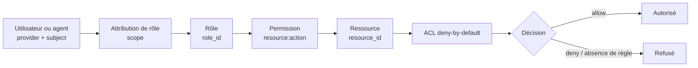

# OPUS P117W — R45D2A21 Security Visual Workspace

Date : 2026-08-12
Statut : spécification active
Base OPUS : `50d68b724a1f32201bd068e0cb23c9f925780093`

## Objectif

Rendre l’espace Sécurité OWASYS aussi graphique et compréhensible que possible, sans dégrader les contrats OPUS : SCORE uniquement, ACL deny-by-default, FSM, I18n, SSO, Logger/Profiler et aucune dépendance JavaScript/Node dans `owasys-back`.

Le vocabulaire UX devient :

- **Ajouter un utilisateur ou un agent** ;
- à terme : **Modifier un utilisateur ou un agent** ;
- à terme : **Supprimer un utilisateur ou un agent**.

Le modèle interne reste une identité canonique `provider + subject`.

## Cause traitée

Le snapshot de sécurité courant ne contient aucun type explicite permettant de distinguer honnêtement une personne d’un compte de service. Une séparation graphique Utilisateurs/Agents ne doit donc jamais être déduite du nom, du rôle ou du provider.

R45D2A21 introduit `identity_type` avec les seules valeurs :

- `user` ;
- `agent`.

Les identités historiques sans ce champ restent visibles sous **À classifier** (`unknown`). Aucun classement implicite.

## Modèle d’autorisation

Les droits portent sur des **ressources**, jamais sur les boutons de l’interface.



Le diagramme Mermaid appartient à la documentation Workspace. OWASYS ne charge pas Mermaid au runtime : l’équivalent visuel est rendu en SCORE + CSS pur.

## UI Sécurité

La longue page technique est remplacée par une organisation graphique :

1. carte de flux visuelle `Utilisateurs/Agents → Attributions → Rôles → Permissions → Ressources/ACL` ;
2. accordéon **Utilisateurs et agents** ;
   - sous-accordéon **Utilisateurs** ;
   - sous-accordéon **Agents** ;
   - sous-accordéon **À classifier** pour les identités legacy ;
3. accordéon **Rôles** ;
4. accordéon **Permissions** ;
5. accordéon **Attributions** ;
6. accordéon **Ressources et ACL**.

Les accordéons sont des `<details>/<summary>` SCORE/HTML natifs. Aucun JavaScript n’est nécessaire.

## Mutation identity.reference

`identity.reference` transporte désormais :

- `provider` ;
- `subject` ;
- `identity_type = user|agent`.

La phase Preview doit conserver `identity_type` jusqu’au Commit ; le binding fresh-auth/FSM reste inchangé et couvre le JSON exact de mutation.

## Destruction / modification

Le backend courant déclare encore `destructive_mutations=false`. R45D2A21 ne doit donc pas afficher de faux boutons Modifier/Supprimer. Les actions `Modifier` et `Supprimer` seront exposées seulement après implémentation backend atomique, preview/commit/rollback et protection du dernier administrateur.

## I18n

Les nouvelles clés UX sont disponibles pour les 24 langues officielles de l’UE plus l’ukrainien :

- `security.users`
- `security.agents`
- `security.unclassified`
- `security.identity_type`
- `security.user`
- `security.agent`
- `security.access_model`

`security.identities` devient le libellé UX « Utilisateurs et agents » et `security.identity_reference` devient « Ajouter un utilisateur ou un agent ».

## Contraintes

- SCORE uniquement ;
- aucune dépendance Mermaid/JS runtime ;
- aucun classement user/agent implicite ;
- aucun secret dans UI, Git, logs ou Profiler ;
- backend décisif pour les mutations ;
- toutes les vues restent accessibles à viewer en lecture seule conformément à la matrice ;
- developer/admin conservent Preview + Commit ;
- les formulaires postent vers la vue métier correspondante pour préserver la garde mutation/view du contrôleur.

## Livrable

```text
ZIP     : opus_p117w_r45d2a21_security_visual_workspace.zip
SHA-256 : 86ad0e9f9815d0af56d416bf6939b944656f344dc62227fb7e2bb513567a426a
BASE    : 50d68b724a1f32201bd068e0cb23c9f925780093
FILES   : 3
```

## Gate owner

Exiger :

```text
OPUS_R45D2A21_APPLIED locales=25
OPUS_R45D2A21_SMOKE_OK locales=25
```

Puis ouvrir Sécurité avec `developer` :

- carte graphique visible ;
- accordéons visibles ;
- utilisateurs / agents / à classifier séparés ;
- formulaire « Ajouter un utilisateur ou un agent » avec choix du type ;
- Preview + Commit d’une nouvelle identité `user` ou `agent` ;
- identité classée dans le bon accordéon après Commit.

Ensuite reprendre le gate viewer de la matrice ACL.
